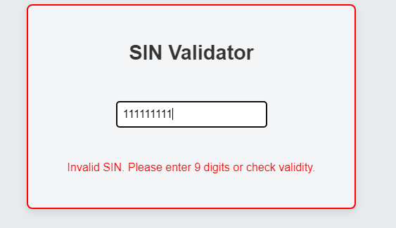

# SIN Validator

A simple Vue 3 application for validating Canadian Social Insurance Numbers (SIN). This project uses TypeScript, and Cypress for end-to-end testing.

## Table of Contents

- [SIN Validator](#sin-validator)
  - [Table of Contents](#table-of-contents)
  - [Overview](#overview)
  - [Features](#features)
  - [Installation](#installation)
    - [Prerequisites](#prerequisites)
    - [Steps](#steps)
  - [Usage](#usage)
    - [Validating a SIN](#validating-a-sin)
  - [Folder Structure](#folder-structure)
    - [Core Files](#core-files)
  - [Testing](#testing)
    - [Running Tests](#running-tests)
    - [Test Cases](#test-cases)
  - [Technologies](#technologies)
  - [Design decisions](#design-decisions)
  - [Possible improvements](#possible-improvements)

## Overview

This application allows users to input a SIN (Social Insurance Number) and validates the input based on:

1. Format check (only 9 digits).
2. Luhn algorithm validation to verify the SIN's correctness.

## Features

- Real-time SIN validation.
- Clear error messages for invalid inputs.
- Visual feedback with border colors based on validation status.
- Input is restricted to 9 numeric digits.

## Installation

### Prerequisites

- **Node.js** and **npm** installed.
- Vue CLI (optional for running Vue apps).

### Steps

1. **Clone the Repository:**

   ```bash
   git clone https://github.com/lsantosdemoura/sin-validator.git
   cd sin-validator
   ```

2. **Install Dependencies:**

   ```bash
   npm install
   ```

3. **Run the Development Server:**

   ```bash
   npm run dev
   ```

4. **Build for Production:**

   ```bash
   npm run build
   ```

The app should now be running at `http://localhost:5173` (or a port specified in the console output).

## Usage

### Validating a SIN

1. Start typing a SIN into the input field.
2. The validator will display:
   - A **green border** and a "Valid SIN" message for valid inputs.


- A **red border** and an "Invalid SIN" message for invalid inputs or formats.



## Folder Structure

```
sin-validator
├── src
│   ├── assets              # Static assets for the app
│   ├── components          # Vue components
│   │   └── SINValidator.vue  # Main SIN validator component
│   ├── views          # Vue views
│   │   └── HomeView.vue  # Root page
│   ├── useCases            # Business logic
│   │   └── validateSIN.ts   # Validation logic for SIN
│   ├── App.vue             # Root component
│   └── main.ts             # Entry point for the application
├── cypress                 # Cypress tests and configuration
│   ├── e2e
│   │   └── sinValidator.cy.ts # Test cases for the SIN validator
├── README.md
└── package.json

```

### Core Files

- **`src/useCases/validateSIN.ts`**: Contains the logic for validating SINs.
- **`src/components/SINValidator.vue`**: Component with input field, validation, and visual feedback.

## Testing

This project uses **Cypress** for end-to-end testing.

### Running Tests

1. **Start the Application**: Make sure the app is running locally on `http://localhost:5173`.
2. **Run Cypress**:

   ```bash
   npx cypress run
   ```

3. Open Cypress UI:

   ```bash
   npx cypress open
   ```

### Test Cases

The Cypress tests include:

- **Initial State**: Checks for the neutral border and no message when input is empty.
- **Invalid Format**: Verifies error message and red border for an invalid SIN.
- **Valid SIN**: Displays a valid message and green border for a correct SIN.
- **Reset State**: Ensures the state is neutral when input is cleared.
- **Edge Cases**: Tests for non-numeric characters and other invalid inputs.

## Technologies

- Vue 3
- TypeScript
- Lodash for debouncing validation input
- Cypress for end-to-end testing

## Design decisions

I decided to build a frontend-only app because it would be fastest than developing both backend and frontend as it wouldn't need to increase the project scope. The calculations are simple enough that they don’t need to be processed on server-side. I chose Vue over React due to its simplicity and its grow as the tool chosen on projects using Django — since my main experience is with Python — so I wanted to test it and increase my knowledge on possible full-stack projects in the future. Finally I also wanted to add only a basic CSS to match the app simplicity.

The project is organized thinking about separation of concerns. The SIN validation logic is in a dedicated `useCases` folder for better reusability and testability and the component just import it for it's usage, the Luhn algorithm is also separated as it can be used on other situations as in Credit card and IMEI numbers. I also implemented the lodash debouncing to reduce unnecessary function calls. Finally, I chose Cypress for end-to-end testing to ensure the app works correctly in various scenarios.

## Possible improvements

As the Luhn algorithm is separated from the rest of the code, this creates a possibility of having different validations on the same app, and this can grow even more by isolating other common functions for validating other types of code such as a function that removes letters from a string or another function that calculates the size of a string. Another great opportunity is creating a generator of those codes, as there are already validations, creating valid codes wouldn't be so hard to implement
